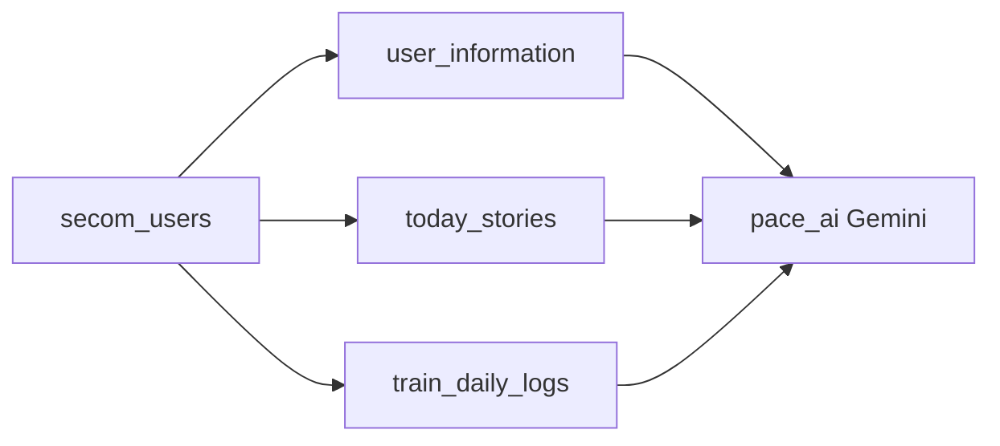
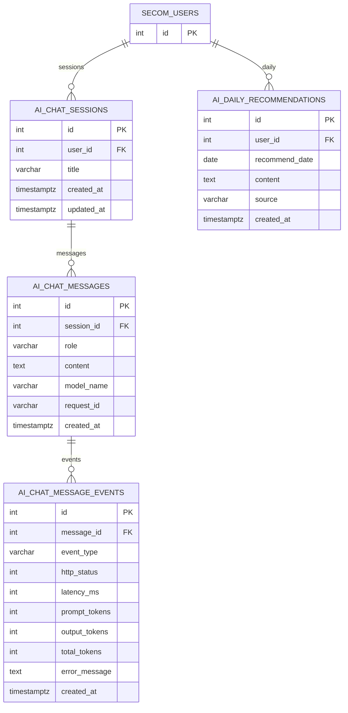

# Pace AI ERD (Phase 2)

> **통합 ERD 한 장:** [[PACE_FULL_ERD]] (secom + inbody + pace_ai)

Pace AI 전용 테이블. **inbody에 넣지 않음.** 읽기는 [[PACE_ERD]]의 프로필·기록 테이블.

**Obsidian:** Mermaid 플러그인 ON + **읽기 모드**. 관계 라벨에 따옴표를 쓰지 않습니다.

관련: [[ENTITY_RULE]] · [[PACE_ERD]]

---

## AI가 읽는 데이터 (DB 테이블 아님)

Pace AI는 아래 테이블을 **조회만** 하고, 결과는 `ai_*`에 저장합니다.

| 읽기 | DB 테이블 |
|------|-----------|
| 마이페이지 | `user_information` |
| 오늘 감정 | `today_stories` |
| 훈련·식단 | `train_daily_logs` |

---

## Phase 2 ERD (예정)

### 실제 테이블명 (구현 시)

| 다이어그램 | DB 테이블 |
|----------|-----------|
| AI_CHAT_SESSIONS | `ai_chat_sessions` |
| AI_CHAT_MESSAGES | `ai_chat_messages` |
| AI_CHAT_MESSAGE_EVENTS | `ai_chat_message_events` |
| AI_DAILY_RECOMMENDATIONS | `ai_daily_recommendations` |

### 관계

| 관계 | 설명 |
|------|------|
| SECOM_USERS → AI_CHAT_SESSIONS | 1:N, Pace AI 탭 대화 |
| AI_CHAT_SESSIONS → AI_CHAT_MESSAGES | 1:N, `role` = user / model |
| AI_CHAT_MESSAGES → AI_CHAT_MESSAGE_EVENTS | 1:N, 메타데이터/에러/토큰/지연 기록 |
| SECOM_USERS → AI_DAILY_RECOMMENDATIONS | 1:N, UK `(user_id, recommend_date)` |

---

## 컬럼 안

### ai_chat_sessions

| 컬럼 | 타입 |
|------|------|
| id | int PK |
| user_id | int FK → secom_users.id |
| title | varchar nullable |
| created_at | timestamptz |
| updated_at | timestamptz |

### ai_chat_messages

| 컬럼 | 타입 |
|------|------|
| id | int PK |
| session_id | int FK |
| role | varchar |
| content | text |
| model_name | varchar nullable |
| request_id | varchar nullable |
| created_at | timestamptz |

### ai_chat_message_events

> 원문 메시지(`content`)를 무조건 전부 보관하지 않아도 되게, 운영/품질 메타데이터는 이벤트 테이블로 분리합니다.

| 컬럼 | 타입 |
|------|------|
| id | int PK |
| message_id | int FK |
| event_type | varchar (created / sent / error) |
| http_status | int nullable |
| latency_ms | int nullable |
| prompt_tokens | int nullable |
| output_tokens | int nullable |
| total_tokens | int nullable |
| error_message | text nullable |
| created_at | timestamptz |

### ai_daily_recommendations

| 컬럼 | 타입 |
|------|------|
| id | int PK |
| user_id | int FK |
| recommend_date | date |
| content | text |
| source | varchar gemini or fallback |
| created_at | timestamptz |

---

## 구현 순서

1. `/chat`에 프로필 컨텍스트 주입 (테이블 0개)
2. `ai_daily_recommendations`
3. `ai_chat_sessions` + `ai_chat_messages`
