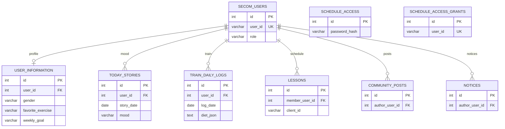
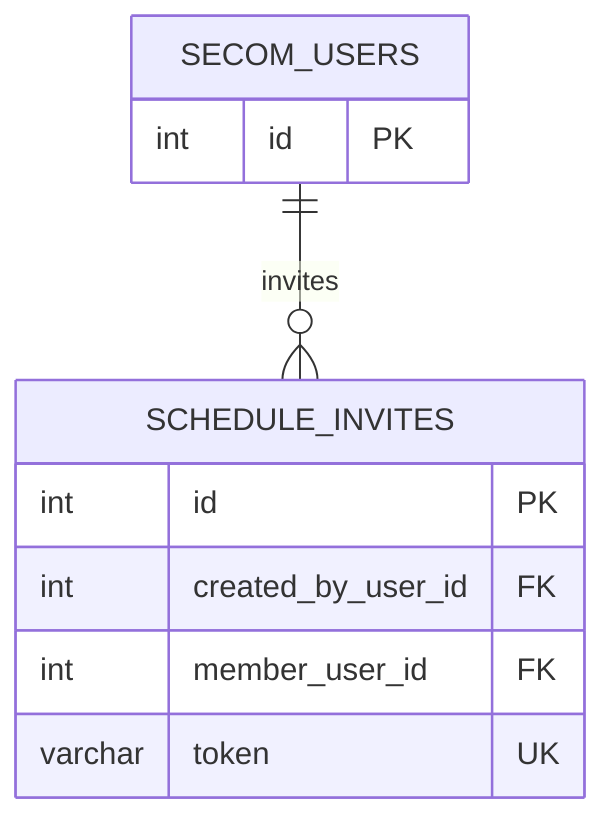

# Pace ERD (secom + inbody)

> **완성 ERD 한 장 (지금 DB 전체):** [[PACE_FULL_ERD]]  
> 정규화 0NF→3NF 단계별: [[PACE_ERD_NORMALIZATION]]

Neon PostgreSQL 기준. **`secom_users.id`(int)** 가 모든 회원 데이터 FK 허브입니다.

**Obsidian에서 안 보일 때**

1. **설정 → 코어 플러그인 → Mermaid** 켜기  
2. 노트를 **읽기 모드**(`Ctrl+E`) 또는 **라이브 프리뷰**로 열기 (소스 모드만이면 코드만 보임)  
3. 볼트 루트를 **`docs` 폴더**로 열었는지 확인  

Mermaid `erDiagram`은 관계 라벨의 **따옴표·콜론·괄호**에서 깨지기 쉽습니다. 아래 다이어그램은 그걸 피한 문법이고, 상세는 표를 참고하세요.

관련: [[ENTITY_RULE]] · [[PACE_AI_ERD]] · **정규화 단계별 ERD:** [[PACE_ERD_NORMALIZATION]]

---

## 제품 기능 ↔ 테이블

| # | 기능 | 이용 대상 | 테이블 (모듈) | 단계 |
|---|------|-----------|---------------|------|
| 1 | 마이페이지·훈련·감정 기반 AI 운동 추천 | 모두 | 읽기: `user_information`, `today_stories`, `train_daily_logs` · 쓰기: [[PACE_AI_ERD]] | 2 |
| 2 | 코치-회원 스케줄 | coach, user | `lessons`, `role` | 1 |
| 3 | 훈련 기록·추이·암호 스케줄 입장 | user | `train_daily_logs`, `schedule_access`, `schedule_access_grants` | 1 |
| 4 | 커뮤니티 | user | `community_posts` | 1 |
| 5 | 공지 (관리자 작성) | admin | `notices` | 1 |

---

## Phase 1 ERD (운영 중)

### 실제 테이블명 매핑

| 다이어그램 | DB 테이블 |
|----------|-----------|
| SECOM_USERS | `secom_users` |
| USER_INFORMATION | `user_information` |
| SCHEDULE_ACCESS | `schedule_access` |
| SCHEDULE_ACCESS_GRANTS | `schedule_access_grants` |
| TODAY_STORIES | `today_stories` |
| TRAIN_DAILY_LOGS | `train_daily_logs` |
| LESSONS | `lessons` |
| COMMUNITY_POSTS | `community_posts` |
| NOTICES | `notices` |

### 관계

| 관계 | 설명 |
|------|------|
| SECOM_USERS → USER_INFORMATION | 1:1, 마이페이지 (`user_id` → `secom_users.id`) |
| SECOM_USERS → TODAY_STORIES | 1:N, UK `(user_id, story_date)` |
| SECOM_USERS → TRAIN_DAILY_LOGS | 1:N, UK `(user_id, log_date)`, `diet`·`muscles`는 JSONB |
| SECOM_USERS → LESSONS | 1:N, 코치가 회원 `member_user_id`로 관리 |
| SECOM_USERS → COMMUNITY_POSTS | 1:N |
| SECOM_USERS → NOTICES | 1:N, POST/DELETE는 `role=admin`만 |

### 논리만 연결 (FK 없음)

| 테이블 | 설명 |
|--------|------|
| SCHEDULE_ACCESS | 앱 전역 스케줄 암호 1행 |
| SCHEDULE_ACCESS_GRANTS | `user_id` = 로그인 문자열 (`secom_users.user_id`와 의미상 연결) |

---

## Phase 3 예정 (초대링크)

---

## Phase 로드맵

| Phase | 내용 |
|-------|------|
| 1 | 위 secom + inbody (현재) |
| 2 | [[PACE_AI_ERD]] |
| 3 | `schedule_invites` |
| 4 | `food_*` (inbody, 미구현) |
