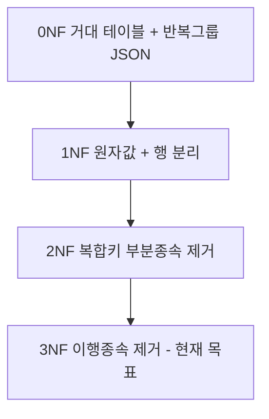
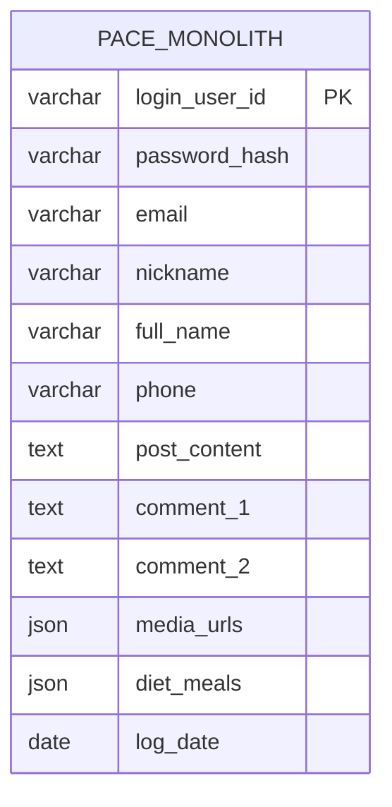
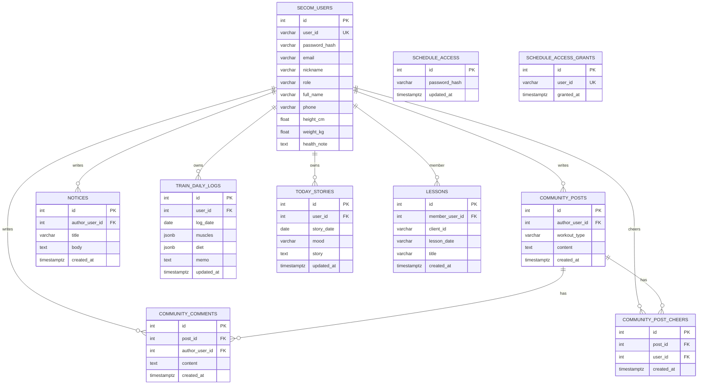
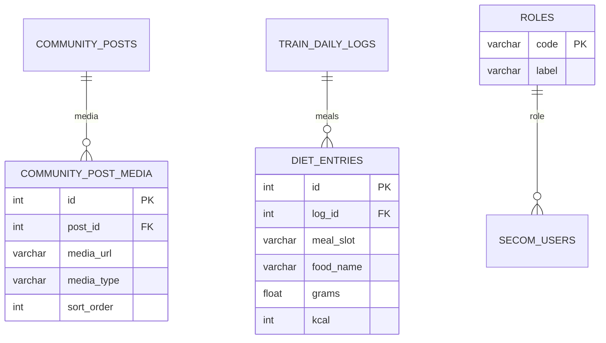

# Pace ERD — 정규화 (secom + inbody)

> Neon PostgreSQL · 모듈 `backend/apps/secom`, `backend/apps/inbody`  
> 통합 운영 ERD: [[PACE_ERD]] · PK 규칙: [[ENTITY_RULE]]

**Obsidian에서 Mermaid가 안 보일 때**

1. 설정 → 코어 플러그인 → **Mermaid** 켜기  
2. **읽기 모드**(`Ctrl+E`) 또는 라이브 프리뷰로 열기  
3. 볼트 루트를 **`docs`** 로 두었는지 확인  
4. `erDiagram` 관계 라벨에 따옴표·콜론·괄호를 넣지 않음 (아래 다이어그램 준수)

#pace #erd #secom #inbody #normalization

---

## 정규화 단계 한눈에



| 단계 | 조건 | 이 프로젝트에서의 변화 |
|------|------|------------------------|
| **0NF** | 반복 그룹·비원자값 허용 | 가상 `PACE_MONOLITH` (아래) |
| **1NF** | 칸마다 원자값, 반복은 별도 행 | 게시·댓글·응원 테이블 분리 |
| **2NF** | 복합키의 일부에만 의존하는 비키 제거 | `user_information` 분리 (`20260520`) |
| **3NF** | 비키 → 비키 이행 제거 | `secom_users.id` FK 허브 (`20260521`) |

---

## 0NF — 정규화 이전 (개념)

로그인·프로필·게시·댓글·운동일지를 **한 테이블**에 두고, 댓글·미디어 URL을 **한 칸의 JSON/배열**로 넣은 상태.



---

## 1NF — 원자값·반복 그룹 제거

- 댓글·응원은 **별도 행** (`community_comments`, `community_post_cheers`)
- 프로필이 아직 `secom_users`에 붙어 있는 시점 (`20260519` 직후)에 가깝게 표현



### 1NF 체크리스트

- [x] 각 컬럼은 스칼라 하나 (JSONB는 PostgreSQL에서 **문서 1개**로 취급 가능)
- [x] 댓글 N개 → N행
- [ ] (선택) `media_json` URL 목록 → `community_post_media` 행으로 쪼개면 논리적으로 더 엄격

---

## 2NF — 부분 함수 종속 제거

복합 **유일 키**에만 의미가 있는 속성은 그 키 전체에만 의존해야 함.

| 테이블 | 유일 키 | 2NF 메모 |
|--------|---------|----------|
| `train_daily_logs` | `(user_id, log_date)` | workout·diet·memo는 쌍에 의존 |
| `today_stories` | `(user_id, story_date)` | story·mood는 쌍에 의존 |
| `lessons` | `(member_user_id, client_id)` | title·time은 쌍에 의존 |
| `community_post_cheers` | `(post_id, user_id)` | UK로 중복 응원 방지 |

**마이그레이션 `20260520`:** 프로필을 `user_information`으로 분리 (로그인 `user_id` 문자열 FK 시기).

```mermaid
erDiagram
    SECOM_USERS ||--|| USER_INFORMATION : profile

    SECOM_USERS {
        int id PK
        varchar user_id UK
        varchar password_hash
        varchar email
        varchar nickname
        varchar role
    }

    USER_INFORMATION {
        varchar user_id PK_FK
        varchar full_name
        varchar birth_date
        varchar phone
        float height_cm
        float weight_kg
        varchar favorite_exercise
        varchar weekly_goal
        text health_note
    }
```

> 이후 **`20260521`**: `user_information.user_id` → `int FK → secom_users.id`, 양쪽 `id` surrogate PK.

---

## 3NF — 이행 함수 종속 제거 (현재 ORM 설계)

작성자 `nickname`·`email`은 **`secom_users`만** 갖고, 게시글·댓글은 `author_user_id` FK만 둠.

```mermaid
erDiagram
    SECOM_USERS ||--|| USER_INFORMATION : profile
    SECOM_USERS ||--o{ TODAY_STORIES : mood
    SECOM_USERS ||--o{ TRAIN_DAILY_LOGS : train
    SECOM_USERS ||--o{ LESSONS : schedule
    SECOM_USERS ||--o{ COMMUNITY_POSTS : posts
    SECOM_USERS ||--o{ COMMUNITY_COMMENTS : comments
    SECOM_USERS ||--o{ COMMUNITY_POST_CHEERS : cheers
    SECOM_USERS ||--o{ NOTICES : notices
    COMMUNITY_POSTS ||--o{ COMMUNITY_COMMENTS : has
    COMMUNITY_POSTS ||--o{ COMMUNITY_POST_CHEERS : has

    SECOM_USERS {
        int id PK
        varchar user_id UK
        varchar password_hash
        varchar email
        varchar nickname
        varchar role
    }

    USER_INFORMATION {
        int id PK
        int user_id FK_UK
        varchar full_name
        varchar gender
        varchar birth_date
        varchar phone
        float height_cm
        float weight_kg
        varchar favorite_exercise
        varchar favorite_exercise_other
        varchar exercise_experience
        varchar weekly_goal
        text health_note
    }

    SCHEDULE_ACCESS {
        int id PK
        varchar password_hash
        varchar updated_by_user_id
        timestamptz updated_at
    }

    SCHEDULE_ACCESS_GRANTS {
        int id PK
        varchar user_id UK
        timestamptz granted_at
    }

    TODAY_STORIES {
        int id PK
        int user_id FK
        date story_date
        varchar mood
        text story
        timestamptz updated_at
    }

    TRAIN_DAILY_LOGS {
        int id PK
        int user_id FK
        date log_date
        jsonb muscles
        text workout
        float weight_kg
        jsonb diet
        text memo
        int exercise_minutes
        timestamptz updated_at
    }

    LESSONS {
        int id PK
        int member_user_id FK
        varchar client_id
        varchar lesson_date
        varchar title
        varchar time
        text schedule_note
        jsonb record
        timestamptz created_at
    }

    COMMUNITY_POSTS {
        int id PK
        int author_user_id FK
        varchar workout_type
        text content
        float distance_km
        int duration_min
        int calories
        jsonb media_json
        timestamptz created_at
    }

    COMMUNITY_POST_CHEERS {
        int id PK
        int post_id FK
        int user_id FK
        timestamptz created_at
    }

    COMMUNITY_COMMENTS {
        int id PK
        int post_id FK
        int author_user_id FK
        text content
        timestamptz created_at
    }

    NOTICES {
        int id PK
        int author_user_id FK
        varchar title
        text body
        timestamptz created_at
    }
```

### DB 테이블명 · 모듈

| ERD 엔티티 | DB 테이블 | Python 모듈 |
|------------|-----------|-------------|
| SECOM_USERS | `secom_users` | `secom/app/models/user_model.py` |
| USER_INFORMATION | `user_information` | `secom/app/models/user_information_model.py` |
| SCHEDULE_ACCESS | `schedule_access` | `secom/app/models/schedule_access_model.py` |
| SCHEDULE_ACCESS_GRANTS | `schedule_access_grants` | `secom/app/models/schedule_access_grant_model.py` |
| TODAY_STORIES | `today_stories` | `inbody/models/today_story_model.py` |
| TRAIN_DAILY_LOGS | `train_daily_logs` | `inbody/models/train_log_model.py` |
| LESSONS | `lessons` | `inbody/models/schedule_model.py` |
| COMMUNITY_POSTS | `community_posts` | `inbody/models/community_model.py` |
| COMMUNITY_POST_CHEERS | `community_post_cheers` | `inbody/models/community_model.py` |
| COMMUNITY_COMMENTS | `community_comments` | `inbody/models/community_model.py` |
| NOTICES | `notices` | `inbody/models/notice_model.py` |

### 카디널리티

| 관계 | 비율 |
|------|------|
| `secom_users` ↔ `user_information` | 1 : 0..1 |
| `secom_users` → `train_daily_logs` | 1 : N (UK로 일자당 1행) |
| `secom_users` → `today_stories` | 1 : N (UK로 일자당 1행) |
| `community_posts` → `community_comments` | 1 : N |
| `community_posts` ↔ `secom_users` (응원) | M : N (`community_post_cheers`) |

### FK 없이 논리만 연결 (3NF 보완 여지)

| 테이블 | 이슈 | 권장 |
|--------|------|------|
| `schedule_access_grants.user_id` | 로그인 문자열, `secom_users.id` FK 없음 | `member_id int FK` 로 변경 |
| `schedule_access.updated_by_user_id` | 문자열 | `updated_by_id int FK` |
| `community_posts.media_json` | URL 배열 JSON | `community_post_media` 테이블 |
| `train_daily_logs.diet` | 식단 JSON | `diet_entries` 테이블 (미구현) |

---

## 3NF+ 확장 (선택 · 미구현)



---

## 마이그레이션 타임라인

| Revision | 내용 | 정규화 |
|----------|------|--------|
| `20260519_mypage` | `secom_users`에 프로필 컬럼 추가 | 0NF→1NF 전 단계 |
| `20260520_user_info` | `user_information` 생성·프로필 이전 | **2NF** |
| `20260521_entity_id` | `id` PK, FK를 `secom_users.id`로 | **3NF** |
| `20260522_inbody` | inbody 콘텐츠 테이블 | 3NF 자식 |
| `20260523` | `user_information.gender` | 3NF 유지 |

---

## 소스 파일 빠른 링크

- `backend/apps/secom/app/models/`
- `backend/apps/inbody/models/`
- `backend/alembic/versions/20260522_inbody_tables.py`
